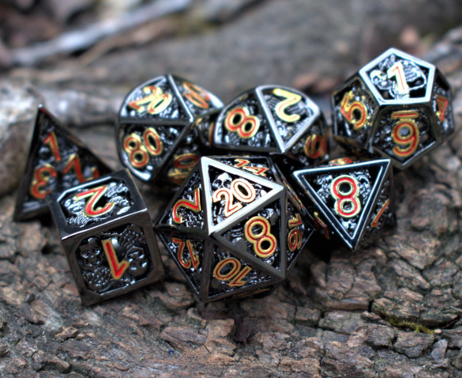

# intertextual source for ttprgs

- # Research for RPG/TTRPG systems
	- Reddit RPG Design Wiki [link](https://www.reddit.com/r/RPGdesign/wiki/resources/)
	- fari.games systems [link](https://fari.games/)
	- itch.io - self publishing website [link](https://itch.io/)
	- D&D and Wizards have something called the Open Gaming License in which people are able to use their system as long as they publish under the same license.
	- **Open Game License (OGL)** is the license in which many game systems are published under open source principles.
	- Specifically its done under the System Reference Document of the 3rd Edition.
	- **Systems Reference Document (SRD)** is the core deliverable white paper report that details all the mechanics that make up a gameplay engine
	- I should look into researching one of these engines, perhaps I can build the universe atop one.
	- ### The most prominent SRDs in the Top 200 RPGs found on rpggeek.com
		- Basic Role-Playing (BRP) [link](https://rpggeek.com/rpgsystem/603/basic-role-playing-brp)
		- D&D 5E Game System [link](https://rpggeek.com/rpgsystem/69967/dd-5e-game-system)
		- Narrative Dice System [link](https://rpggeek.com/rpgsystem/26027/narrative-dice-system)
		- Pathfinder System [link](https://rpggeek.com/rpgsystem/2789/pathfinder-system)
		- Powered by the Apocalypse [link](https://rpggeek.com/rpgsystem/17185/powered-apocalypse)
		- d20 system [link](https://rpggeek.com/rpgsystem/467/d20-system)
		- Fate 3.0 [link](https://rpggeek.com/rpgsystem/577/fate-30)
		- 2d20 [link](https://rpggeek.com/rpgsystem/34087/2d20-system)
		- Fudge System [link](https://rpggeek.com/rpgsystem/660/fudge)
		- Gumshoe System [link](https://rpggeek.com/rpgsystem/1264/gumshoe)
		- Open D6 [link](https://rpggeek.com/rpgsystem/8528/d6-system-opend6)
		- Dynamic Gaming System [link](https://rpggeek.com/rpgsystem/25139/dynamic-gaming-system)
		- Mongoose Traveller System [link](https://rpggeek.com/rpgsystem/4170/mongoose-traveller-system)
		- Hero Systems 6 [link](https://rpggeek.com/rpgsystem/2653/hero-system-6)
		- Pip System [link](https://rpggeek.com/rpgsystem/22880/pip-system)
		- Polymorph System [link](https://www.9thlevel.com/polymorph)
		- Saga Machine [link](https://rpggeek.com/rpgsystem/33740/saga-machine)
		- W.O.I.N. [link](https://rpggeek.com/rpgsystem/27060/whats-old-new)
		- Cinematic Unisystem RPG [link](https://i.4pcdn.org/tg/1437098890776.pdf)
		- Year Zero Engine [link](http://frank-mitchell.com/rpg/year-zero-engine-ogl/).
	- ### Award Giving Bodies
		- Ennies Tabletop RPG Awards [link](https://ennie-awards.com/2022-results/)
		- IGDN Indie Game Developer Network [link](https://www.igdnonline.com/groundbreakers)
		- Nebula Awards [link](https://nebulas.sfwa.org/)

  public:: true
  
- # GURPS TTRPG writing best practices
	- GURPS rules are usually written in the third person, with "you" used only in introductions, not in rules language or background descriptions. Rules examples may address the character directly: "You must roll against ST to move the rock." *__GURPS__* advantages, disadvantages, and skills may be written in the same style.
	- Present historical information in the past tense and campaign information in the present tense.
	- We avoid future tense, except where it is grammatically necessary. Rules information should be present tense, *not* future. Note the correct transition from past to present tense in the example below.
	-
---
	- ## Style of Presentation
	- *Italics*
	- Use *italic* in references to chapters or sections – for instance, "See *Phlebotomy*, pp. 12-14."
	- Use italic for ship and aircraft names
	- any time ordinary emphasis is required.
	- Italicize the first instance of foreign terms
	- Vignettes or quotations at the start of a section are in italic.
	- *Italicize* the edition of a *__GURPS__* product when it accompanies the *__GURPS__* title (e.g., **GURPS** Fourth Edition) but not when it is by itself (updated to the Fourth Edition).
	- **Dude these guys have such a fucking power complex its so fucking cringe. Its like sophomore kids in highschool mimicking what they believe authority is by shitting in each other's mouths in front of the freshmen. Dude you break half your shitty ass rules in your fucking roolebook you shit neck retard**
	-
- # Incredible Looking Dice
	- {:height 476, :width 572}
	- [misty mountain gaming death's shadow necro metal](https://mistymountaingaming.com/collections/metal-dice-sets/products/deaths-shadow-necro-metal-dice-set)
	-

