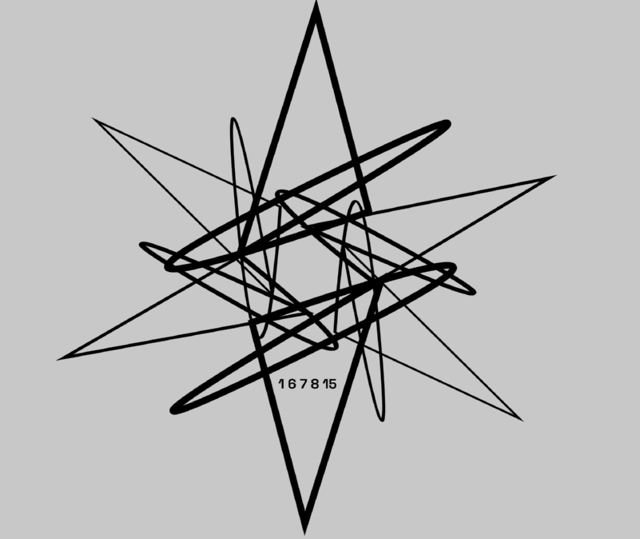

- # elaborating on the unicursal design logo
- 
- The numbers 1, 6, 7, 8, and 15 on the Golden Record cover of the Voyager 1 spacecraft are part of a diagram explaining the location of our solar system with respect to 14 pulsars, which are rapidly spinning neutron stars that emit a beam of electromagnetic radiation. The diagram on the Golden Record cover is known as the pulsar map.
- Here's what these numbers represent:
- 1. **Hydrogen:** The number 1 represents the hyperfine transition of neutral hydrogen, which is used as a universal time and distance unit in the pulsar map. This is because hydrogen is the most abundant element in the universe, and its properties are universally recognized.
- 2. **Binary Representations:** The numbers 6, 7, 8, and 15 are part of the binary representations of the periods of the pulsars. Each line in the diagram has a series of binary digits that indicate the pulsar's period of rotation, giving information about their specific rates of spin.
- 3. **Pulsar Map:** The lengths of the lines show the relative distances to the pulsars from the Sun, and each line has a corresponding set of binary numbers that represent the pulsar's frequency. The idea is that an advanced extraterrestrial civilization could use this information to locate the Solar System.
- The Golden Record itself is a gold-plated copper disc that contains sounds and images selected to portray the diversity of life and culture on Earth, intended for any intelligent extraterrestrial life form, or for future humans, who may find it. The pulsar map is a way to tell those who might discover the record where its spacecraft originated.
-
- The numbers 1, 6, 7, 8, and 15 on the Golden Record cover of the Voyager 1 spacecraft are part of a diagram explaining the location of our solar system with respect to 14 pulsars, which are rapidly spinning neutron stars that emit a beam of electromagnetic radiation. The diagram on the Golden Record cover is known as the pulsar map.
- Here's what these numbers represent:
- 1. **Hydrogen:** The number 1 represents the hyperfine transition of neutral hydrogen, which is used as a universal time and distance unit in the pulsar map. This is because hydrogen is the most abundant element in the universe, and its properties are universally recognized.
- 2. **Binary Representations:** The numbers 6, 7, 8, and 15 are part of the binary representations of the periods of the pulsars. Each line in the diagram has a series of binary digits that indicate the pulsar's period of rotation, giving information about their specific rates of spin.
- 3. **Pulsar Map:** The lengths of the lines show the relative distances to the pulsars from the Sun, and each line has a corresponding set of binary numbers that represent the pulsar's frequency. The idea is that an advanced extraterrestrial civilization could use this information to locate the Solar System.
- The Golden Record itself is a gold-plated copper disc that contains sounds and images selected to portray the diversity of life and culture on Earth, intended for any intelligent extraterrestrial life form, or for future humans, who may find it. The pulsar map is a way to tell those who might discover the record where its spacecraft originated.
- # overarching documents
	- # unicursal design systems documentation
		- ## defining dualism and relativism
	- # leechseed codex
		- ## top-down TTRPG inspired multiverse design document
	- # The Adventures of 3D Lifeseeds and Unicursal Leechforms
		- ## relativistic stories in 10 year increments
		- ## bottom up, entertainment focused stories. THIS IS THE MEAT OF MY BEING.
	- # NERV Box
		- ## evergreen mentality instrumentality style of notes
		-
