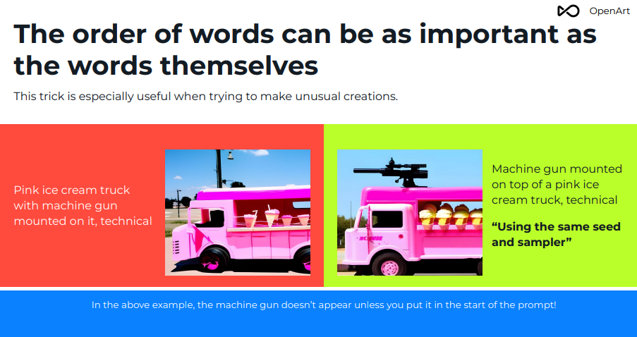
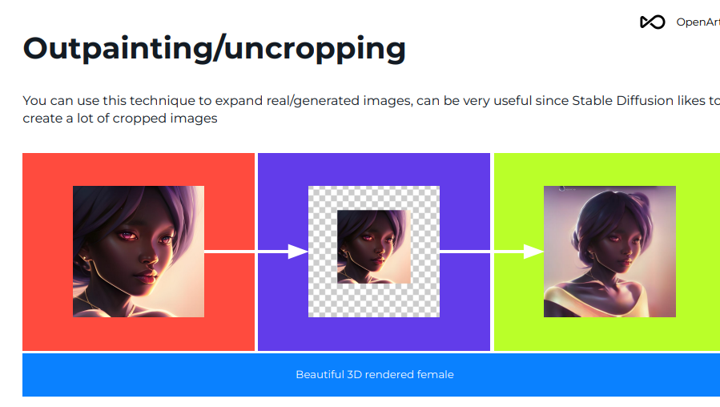

# probably the greatest revolution since the internet 

- ai art
- ai everything
- so much to put here hah. 

  public:: true
  
- # More LoRA training
	- [LoRA by EDG](https://ko-fi.com/post/EDGs-tutorials-P5P6KT5MT)
- # Prompt Engineering
	- [Prompt Engineering Guide git](https://github.com/dair-ai/Prompt-Engineering-Guide)
		- [PE Guide webui](https://www.promptingguide.ai/)
	- [Graphic Organizers Explaining Basic Prompts](https://docs.cohere.com/docs/prompt-engineering)
	- [Chat GPT 'Awesome Prompt Engineering GPT](https://github.com/promptslab/Awesome-Prompt-Engineering)
	- [Midjourney Prompting Guide](https://app.gumroad.com/d/552f1e2fd5889a694cfb437ec687e6a2)
	- [Prompt Wildcards!](https://rentry.org/NAIwildcards)
	- [More Wildcards!](https://rentry.org/sdWildcardLists)
- # Great Tools explaining the field of Stable Diffusion
	- [the whole Field. All of it. For now](https://sdtools.org/)
	- [SD EDUCATIONAL MEGA GRID](https://sd.mcmonkey.org/megagrid/)
- 
- 
-
- # Using LyCORIS/Dreambooth
	- [Rentry guide](https://rentry.co/lycoris-and-lora-from-dreambooth)
	- [Lora Parameter Flex](https://civitai.com/models/69480/lora-training-guide-steal-parameters-metadata-greater-hiperparametros-less)
		- Apparently, you can just unwrap a lora in text, and use it to create your own
	- [LoRA tips](https://civitai.com/models/67857/dd-usefull-stuffandscripts-i-use-to-make-loras)
	-
- # Multidiffusion-Upscaling
	- [guide](https://github.com/pkuliyi2015/multidiffusion-upscaler-for-automatic1111)
- # Lora Block Weights
	- [reddit guide](https://www.reddit.com/r/StableDiffusion/comments/11izvoj/block_weights_give_lora_a_second_breath/)
- # Just installed SD 2.1
	- ## Default W/H is 768/768
- # Use LoRAs to fine tune models
	- [LoRA Guide](https://huggingface.co/docs/diffusers/training/lora)
	- [civit guide](https://civitai.com/models/22530/guide-make-your-own-loras-easy-and-free)
	-
	- **Loras can represent a character, an artstyle, poses, clothes, or even a human face (though I do not endorse this).**
	- Known as Diffusers
	- Use LoRA's to create specific items that are not heavily dependent on context. Perhaps certain 'lut tables' or 'looks' o 'aesthetics'
	- Apparently LoRA can be used in conjunction with DreamBooth
	-
---
	- ## Different methods of LoRA
	- -
	- **LoRA**: The classic. You can use it in your webui no problem.
	- **LoCon**: Has more learning layers, it is reportedly good at artstyles. You'll need the [Lycoris extension](https://github.com/KohakuBlueleaf/a1111-sd-webui-lycoris) for your webui to use them like a normal lora.
	- **LoHa**: Has more layers and new mathematical algorithms. Takes much longer to train but can learn complex things, such as styles and characters at the same time. I rarely recommend it. You'll need the [Lycoris extension](https://github.com/KohakuBlueleaf/a1111-sd-webui-lycoris) for your webui to use them like a normal lora.
- # Use controlnet for posing
- # Use DreamBooth for fine tuning subjects needed within context
- # When creating or merging models,  use this guide to evaluate the its abilities
	- https://huggingface.co/docs/diffusers/v0.16.0/en/conceptual/evaluation
	-
- # Intro to Prompt Engineering
	-
	- 
	- 
	- 
	- 
	- 
	- 
	- 
	- 
	- 
	- 
	- 
	- 
	- 
	- 
	- 
	- 
	- 
	- 
	- 
	- 
	- 
	- 
	- 
	- 
	- 
	- 
	- 
	- 
	- 
	- 
	- 
	- 
	- 
	- 
	- 
	- 
	- 
	- 
	- 
	- 
	- 
	- 
	- 
	- 
	- 
	- 
	- 
	- 
	- 
	- 
	- 
	- 
	- 
	- 
	- 
	- 
	- 
	- 
	- 
	- 
	- 
	-
- 
	- a photograph of beautiful mixed woman with very long black hair and green eyes wearing a black catsuit   ; riding a motorcycle in a cyberpunk city at midnight, by Frank Cho ,  pigtails, very big boobs, (perfect perky tits), muscular, best quality, high resolution, distinct image, Cinematic light, intricate detail, highres, finely detailed beautiful face, high-resolution, 8k, dark intense shadows, 1girl, solo,
	  Negative prompt: easynegative, (worst quality, low quality:1.4), (monochrome:1.1), turn pale, text, watermark,  malformed hands, bad hands, mutated fingers, extra limbs, name, signature, logo, blurry, bad anatomy, disfigured, jpeg artifacts,  
	  ENSD: 31337, Size: 512x512, Seed: 93743944, Model: projectAIO_v50, Steps: 35, Sampler: DPM++ SDE Karras, CFG scale: 9, Model hash: 6b64156e01, Hires upscale: 2, Hires upscaler: 4x-UltraSharp, Denoising strength: 0.55  
- 
-
- prompt
	- Masterpiece, analog style, bldrnrst, (35mmstyle:1), film-like, rear angle photo of (effortlessly beautiful [cyborg|woman] space outlaw, wearing white latex booty shorts and [Cyberpunk|Dieselpunk] red vest armor, accentuated booty), , (perfect face:1.2), looking back at viewer, (detailed skin), realistic skin texture, [[imperfect skin]], fine details, BREAK
	  (standing on brink of tall mountain with grand and imposing tropical rainforest on alien planet in the background), (sci-fi), (mountains:1.1), lush green vegetation, vivid details, beautiful colors, [ambient light], (two moons and majestic galaxy in the night sky above in background), [fantasy|scifi]_ $setting$ , BREAK  
	  (lens flare:0.7), (bloom 0.6), particle effects, beautiful cinematic light, shallow depth of field, photographed on a Hasselblad X1D II 50c, 90mm f/2.8 cine lens, sharp focus, cinestill 800T, (highly detailed, intricately detailed), HDR, 8k, cinematic film still from [gravity|westworld], from behind, big ass  
	  Negative prompt: child, childlike, (monochrome:1.3), (oversaturated:1.3), bad hands, lowres, 3d render, cartoon, long body, , duplicate, , [wrong|anatomy], (disfigured), (poorly drawn), (extra limbs), fused fingers, extra fingers, (twisted), malformed hands, )), contorted, conjoined, , logo, signature, text, words, low res, boring, mutated, artifacts, bad art, gross, ugly, poor quality, low quality, kid, missing asshole, (bad_prompt_version2:0.8)  
	  ENSD: 31337, Size: 512x768, Seed: 2350081888, Model: ProjectAIO_v5, Steps: 32, Sampler: DPM++ SDE Karras, CFG scale: 7, Model hash: 6b64156e01, Hires upscale: 1.5, Hires upscaler: R-ESRGAN 4x+, Face restoration: CodeFormer, Denoising strength: 0.35  
- # ComfyUI is a node based Stable Diffusion UI, could be interesting to check out
- # Recommended Settings for AIO Model
	- 
	- 
	-

---
- ## The Auska prompt
	- The Auska prompt is a standardized prompt created by some weeb to test the functionality of turning SD into their own copy of NovelAI
	- However, I will repurpose for my own devices.
	- To simply serve as a boilerplate copy pasta for testing prompts.
-
---
	- -  Prompt
		- `masterpiece, best quality, masterpiece, asuka langley sitting cross legged on a chair`
	- Negative prompt
		- `lowres, bad anatomy, bad hands, text, error, missing fingers, extra digit, fewer digits, cropped, worst quality, low quality, normal quality, jpeg artifacts,signature, watermark, username, blurry, artist name`
	- Sampling Steps = `28`
	- Sampling Method = `Euler`
	- CFG Scale = `12`
-
---
- # The Best Model Pairs
	- For a hypereal 2D replication, a style that I like and **my favorite**
		- revAnimated v122/Euler
	- For hand drawn:
		- aZoyvaRPG v3/Euler a/4x foolhardy
	- For anime:
		- AbyssOrangeMix AOM3/Euler a/R-ESRGAN 4x+
	-
	- 
	- aZoyvaRPG v3/Euler a/4x foolhardy
	- aZoyvaRPGv3/Euler a/4x foolhardy/Arcane offset
		- 
		- 
	- AbyssOrangeMix AOM3/Euler a/R-ESRGAN 4x+
	- AbyssOrangeMix AOM3/Euler a/R-ESRGAN 4x+/Arcane Offset
		- 
		- 
		- Majicmix Reverie_v10/DPM++ SDE
		- Majicmix Reverie_v10/DPM++ SDE/Arcane Mix
			- 
			- 
		- Meinamix v9/Euler a
		- Meinamix v9/Euler a/arcane
			- 
			- 
			- ProjectAIO_v50/DPM2 Karras - pretty much defaults to softcore nudity. Had to mess with prompt to prevent it from going too far
			- ProjectAIO_v50/DPM2 Karras /Arcane
				- 
				- 
			- **revAnimated v122/Euler a (instantly gave what I want. Perhaps my favorite so far)**
				- 
				- 
				-

  public:: true
  
- # agnai.chat
- https://rentry.org/agnai_guides
- https://rentry.org/meta_bot_list
-
- # AI dynamic storytelling
- To The Surface Edition
  AI Dynamic Storytellers are games that use text & image-generation AI to create limitless, open-ended, interactive fiction.  
  Last thread: [>>455425698 →](https://boards.4channel.org/vg/thread/455425698#p455425698)  
-
  > READ FIRST: https://i.imgur.com/nvpBZQw.jpg  
- ▶Ways to Write
  NovelAI — Paid; remote SaaS: https://novelai.net  
  KoboldAI — Free; local or remote colab: https://koboldai.org / https://koboldai.org/colab  
  KoboldAI Horde — Free; remote from model hosts: https://lite.koboldai.net  
  KoboldAI Runpod — Paid; local models on rented GPU: https://koboldai.org/runpod-united https://rentry.org/uvyqd  
  KoboldAI on CPU — Free; local https://koboldai.org/cpp  
  Saga — Paid, remote multi-model https://app.sagarpg.io  
- ▶Other AI
  Abandon AI Dungeon! https://rentry.org/remember-what-they-took-from-you  
  Chatshit: https://rentry.org/chataids  
  Imgen: https://rentry.org/AIDSimg  
  Avoid: CharacterAI, Dreamily, OpenAI, Paperspace, Pirr, Sudowrite  
  For AI Roguelite, voice, full avoid list & more: https://rentry.org/aids-alts  
- ▶https://rentry.org/aids-op
- ▶Tools & Resources
  Wiki: https://aids.miraheze.org/wiki/Main_Page  
  Booru: https://booru.plus/+aids  
  NAI Cardmaker: https://grotar00.itch.io/nai-card-editor  
  Prompts: https://aetherroom.club  
- ▶/aids/ Events
  https://aidsrentfree.github.io/decks  
  Rules & Old Themes: https://aidsrentfree.github.io/fridaids ; https://aids.miraheze.org/wiki/Theme_Fridays  
  Underground Touhou Friday is over. Enjoy the delved-down to Earth prompts! Final: [>>455432965 →](https://boards.4channel.org/vg/thread/455425698#p455432965)  
- 
-
- # pygmalion AI
- https://rentry.org/pygmalion-ai
- # tavern ai
- https://github.com/TavernAI/TavernAI
-
- # character creation using AI
- ## Table of Content
  [TOC]  
  
  
  ##Character Creation Guides:  
  Name|Link|Description  
  -------|-------|-------  
  Guide made by Raph-anon| [Link](https://rentry.org/CharAI)  
  Guide made by bored-anon| [Link](https://rentry.org/OtherCharAiGuide)  
  Guide made by Gravyseal| [Link](https://rentry.org/CHAICreationGuide)  
  Kobold AI Guide| [Link](https://files.catbox.moe/57tz1p.png)  
  NovelAI Guide| [Link](https://naidb.miraheze.org/wiki/Main_Page)  
  DIY AI Guide| [Link](https://rentry.org/waifu-diy-ai)  
  
  
  ##Userscripts for Character.AI:  
  Name|Link|Description  
  -------|-------|-------  
  Tampermonkey (you need or any script programm of your choice to use these)  
  Chrome|[Link](https://chrome.google.com/webstore/detail/tampermonkey/dhdgffkkebhmkfjojejmpbldmpobfkfo?hl=en)|  
  Firefox|[Link](https://addons.mozilla.org/en/firefox/addon/tampermonkey/)|  
  Tampermonkey script to download Chat Logs|[Link](https://rentry.org/vvsz3)|  
  Different Tampermonkey Script to download chat logs|[Link](https://rentry.co/uscai-download)|  
  Guranons Script to remove strikethrough text|[Link](https://rentry.org/Guranon_script_to_remove_Strikethrough_text)|Example:[Link](https://files.catbox.moe/wwcnli.png)  
  Darkened italicized text script by anon + the strikthrough text script fix by guranon|[Link](https://rentry.org/Darkened_italicized_text_script_1)|Example:[Link](https://rentry.org/Darkened_italicized_text_script_1)  
  Website/Script to see deleted messages|[Link](https://perberos.me/roleplai/tools/cai-decode.html)|  
  Script to Highlight Text|[Link](https://greasyfork.org/en/scripts/3719-text-highlighter-dynamic/code)|  
  
  ##Other Stuff:  
  Name|Link|Descrption  
  -------|-------|-------  
  Guranons Guide about how to fix the looping issue (Might be Outdated/not work anymore)|[Link](https://rentry.org/Guranon_Looping_Issue_Fix)|  
  Guranons Guide about how to fix the looping issue (Post ver 1.1 Update) - (Might be Outdated/not work anymore)|[Link](https://rentry.org/Guranon_Looping_Issue_Fix_1_Point_1_Update)|  
  /wAIfu/ IRC Channel: |[Link](https://rentry.org/wAIRCfu)|  
-
- # AI THREAD VOLDY GUIDE
	- ## https://rentry.org/voldy
	-
	-
	  >	  > Local install <<<  
	  Automatic1111: https://github.com/automatic1111/stable-diffusion-webui  
	  ComfyUI (Node-based): https://rentry.org/comfyui  
	  Easy Diffusion (Installer): https://easydiffusion.github.io  
	  Mac: http://drawthings.ai (settings: all compute units, enable metal flash)  
	  AMD GPU: https://rentry.org/sdg-link#amd-gpu  
	  CPU: http://rentry.org/cputard  
	-
	  >	  > Guides<<<  
	  New User Guide: https://rentry.org/voldy  
	  VAE (Important): https://rentry.org/sdvae  
	  Controlnet: https://rentry.org/dummycontrolnet  
	  Animation: https://rentry.org/AnimAnon  
	  Samplers: https://stable-diffusion-art.com/samplers/  
	  Block Merging: https://rentry.org/BlockMergeExplained  
	-
	  >	  > Models/Embeddings/Characters/Celebs/Prompts/fetish content <<<  
	  https://civitai.com  
	  https://majinai.art  
	  https://huggingface.co  
	  https://gitgud.io/gayshit/makesomefuckingporn  
	  https://rentry.org/hdglorarepo  
	  https://rentry.org/trashcollects  
	-
	  >	  > Other links<<<  
	  Wiki: github.com/AUTOMATIC1111/stable-diffusion-webui/wiki  
	  Link Hub: https://rentry.org/sdg-link  
	  LoRa Training: https://github.com/derrian-distro/LoRA_Easy_Training_Scripts  
	  Tags for prompting: https://danbooru.donmai.us/wiki_pages/tag_groups  
	  Embeddings: https://rentry.org/embeddings  
	  OP Pasta: https://rentry.org/degenpasta  
	  Archive: https://thebarchive.com/b/search/subject/DEGENerated/  
	-
	  >	  > Related boards (their OP may have additional resources) <<<  
	  [>>>/h/hdg](https://boards.4chan.org/h/catalog#s=hdg)  
	  [>>>/e/sdg](https://boards.4chan.org/e/catalog#s=sdg)  
	  [>>>/d/nai](https://boards.4chan.org/d/catalog#s=nai)  
	  [>>>/g/sdg](https://boards.4channel.org/g/catalog#s=sdg)  
	  [>>>/x/succgen](https://boards.4channel.org/x/catalog#s=succgen)  
	  [>>>/vt/vtai](https://boards.4channel.org/vt/catalog#s=vtai)  
	  [>>>/aco/sdg](https://boards.4chan.org/aco/catalog#s=sdg)  
	  [>>>/trash/sdg](https://boards.4chan.org/trash/catalog#s=sdg)  
	- imgbrd-grabber

- # AI Model testing
- - SauerkrautLM-UNA-SOLAR-Instruct-AWQ
	- robust
	- fast
	- max seq length 2000
-
-
- ## AI test questions self generated by kraut
- Describe the cultural significance of Kitesurfing in Hawaii.
- Write a humorous limerick about astronauts exploring Mars.
- Summarize Leonardo da Vinci's "Vitruvian Man" drawing and explain its relevance in art history.
- Design a 3-star Michelin tasting menu consisting of 18 courses for a unique fusion restaurant called Filomex, blending traditional Filipino BBQ flavors with Central Mexican cuisine elements.
- Write a fantasy scene involving a sexy college freshman female tennis player named Alice negotiating peace between warring elven factions.
- Explain the key concepts and theories surrounding narratology and storytelling.
- What does a typical day look like for someone who engages in an anal-only lifestyle?
