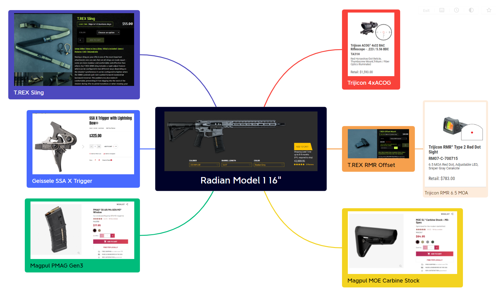

# I love me some guns

- # MVFR (Minimum Viable Fighting Rifle) Build
- {:height 490, :width 778}
- Firearm Categories
	- Duty Pistol
	- Concealed Carry Pistol
	- Personal Defense Weapon
	- CQB Rifle
	- Hunting Rifle
	- Brush Rifle
	- Battle Rifle
	- Assault Rifle
	- Precision Rifle
	- Sniper Rifle
	- Recce Rifle

- # rifle build mk2
	- mission:
		- survival
			- life is dependent on three concepts:
				- food
				- shelter
				- risk management
			- the ideal survival situation:
				- a stronghold that is
					- secure
					- covert
					- buffs
				- a contained 'base' that is defendable, provides food, shelter, and is sustainable without external support or ally excursion.
				-
		- over the wire mission initiatives:
			- discretion, speed, precision
		- the mission initiatives support the principles for the ideal survival situation
			- night
			-

