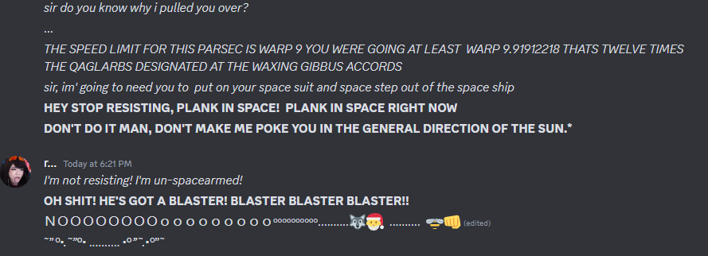

# a form of setting ultimately

# architectural concepts and ideas

## satellite flowers        
What if...on that shoreline...massive yard satellite dishes were seen as flowers. Maybe they knew that they are decensants of people from earth and that they would be back 

### Watch Space Ships
Massive Watch movements as space ships. Quartz crystal or synthetic rubies used as heat sinks. 

These movements are actually powered by human energy? The biggest and most powerful movements have enough energy for hundreda of years. Thus the people on the ship become lazy 

Living forever except inside a time dialation. Where thousands of years go by but within it time exists on it's own. These are the people who are the "final" existence of the human race. Millions of attempts are made to influence the time on the outside to prevent them from going into the time dialation. 

### total vaccuum (tvac lanes) theory
Refraction. Nothing travels faster than the speed of light thru a true vacuum. But is space a true vaccum? What if science fiction includes building lanes of ftl by building low vaccumic space? 

Between these lanes, ships would have to travel in nftl or sftl (near ftl, sub ftl) thus increasing travel times by 10 x

# Whipple shield - how space stations protect themselves from high speed debris. It's basically two shields with a gap between.  The first shield absorbs the impact and breaks apart the debris. The second shield absorbs the smaller less volitile pieces of debris 

  
- # architecture firms that are inspiring
- https://ehdd.com/ Large Buildings, Headquarters,  University schools of study
- https://wonglogan.com/ford-assembly-building/ - incredible Ford assembly plant conversion. Makes me think about a large facility dedicated to virtual produciton
- https://www.plaadoffice.com/process - their process of design is illustrated in a very elegant way. There are components that are highly visual and complex but in a way that encourages creativity thru clear yet flexible constraints.
- ## more to check out
- https://bdarchitects.com/projects/
- https://www.desaichia.com/featured
- https://aidlindarlingdesign.com/
- https://www.fougeron.com/
- https://www.sageandcoombe.com/
- https://www.mfarchitecture.com/
- https://hollanderdesign.com/
- https://www.classicist.org/honors/acanthus-awards/
- https://www.jarvisstudio.com/projects
- https://melissagerstledesign.com/
- https://www.maestristudio.com/portfolio
- https://www.fernsantini.com/portfolio#/bohemian-at-heart/
- https://www.dbhuman.com/
- https://james-duncan.com/
- https://www.antrobus-collective.design/properties
- https://hinostudio.com/
-
- ## resource authorities in the field
- https://www.architecturaldigest.com/
- https://www.veranda.com/
- https://luxeredawards.com/
- https://www.landwatch.com
-
- # Name the compound or facility or home after the the land it sits on
-
- # using fed websites as inspiration for documentation and website design for NARCON - (Narrative Control)
- 
- https://www.dni.gov/
-
-
-
- {:height 187, :width 594}
- {{video(https://youtu.be/AaPpRIbuGlY?si=o-URumtuS6dBMHjF)}}
- 
- 

# Goomers
GOOMERS - are like confessional booths for people to come up to for advice from gamers who don't make any money and just live on the fringe. 